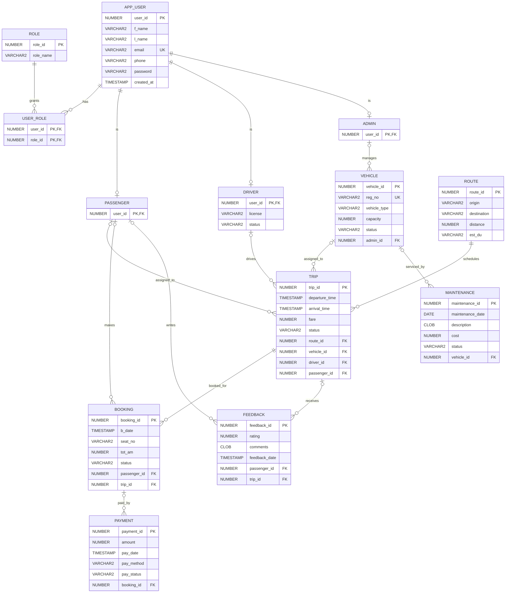

# SmartMove ER diagram

MongoDB complements these normalized Oracle entities with flexible `vehicle_content`, `passenger_feedback`, `travel_announcements`, `user_notifications`, and `community_posts` collections. The new design and safe seed are documented in [`mongodb/seed.js`](./mongodb/seed.js) and [`README.md`](../README.md). The original `MongoDB/` coursework folder is not used by the application.
